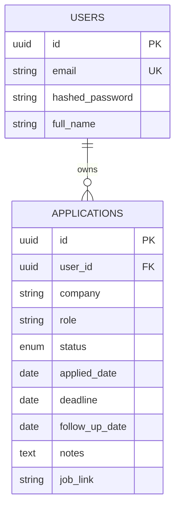

# Job Application Tracker

A full-stack app for tracking job applications: a Kanban pipeline board, a
dashboard with stats and charts, search/filter, and deadline/follow-up
reminders — with JWT-based auth so it's multi-user.

**Live app:** https://jobtracker-nu-black.vercel.app
**Live API:** https://jobtracker-api-rkld.onrender.com (interactive docs at `/docs`)

> The API is on Render's free tier, which spins down after 15 minutes of
> inactivity — the first request after a while can take ~30s to wake it up.
> The free Postgres database also **expires 30 days after creation** (Render
> free-tier limitation); see [Redeploying after the free DB expires](#redeploying-after-the-free-db-expires).

For the reasoning behind the major technical choices (JWT vs. sessions,
Postgres vs. Mongo, token storage, etc.), see **[ARCHITECTURE.md](ARCHITECTURE.md)**.
For the full schema and design rationale, see **[SCHEMA.md](SCHEMA.md)**.

## Tech stack

| Layer | Choice |
|---|---|
| Frontend | React 19 + TypeScript + Vite + Tailwind CSS v4 |
| State/data fetching | TanStack Query (server state) + React Context (auth) |
| Forms/validation | react-hook-form + zod |
| Kanban drag-and-drop | dnd-kit |
| Charts | Recharts |
| Backend | FastAPI (Python) |
| Database | PostgreSQL, via SQLAlchemy 2.0 + Alembic migrations |
| Auth | JWT access + refresh tokens, bcrypt password hashing |
| CI | GitHub Actions (pytest against real Postgres, frontend build) |
| Deployment | Frontend on Vercel, backend + Postgres on Render |

## Project structure

```
jobtracker/
├── backend/            FastAPI app, Alembic migrations, pytest tests
├── frontend/           Vite + React + TS app
├── docker-compose.yml  Local Postgres for development
├── render.yaml         Render Blueprint (backend + Postgres)
├── .github/workflows/  CI
├── SCHEMA.md           Database schema + design rationale
└── ARCHITECTURE.md     Key technical decisions, written for interview prep
```

## Local development

### Prerequisites
- Node.js 20+
- Python 3.12
- Docker (for local Postgres) — or see [Running without Docker](#running-without-docker)

### 1. Database

```bash
docker compose up -d
```

This starts Postgres on `localhost:5432` (user/pass `postgres`/`postgres`, db `jobtracker`).

### 2. Backend

```bash
cd backend
python -m venv venv
./venv/Scripts/activate    # Windows; use `source venv/bin/activate` on macOS/Linux
pip install -r requirements.txt
cp .env.example .env       # defaults already match docker-compose
alembic upgrade head
uvicorn app.main:app --reload --port 8000
```

API is now at `http://localhost:8000`, interactive docs at `http://localhost:8000/docs`.

Run tests:
```bash
pytest -v
```
Tests run against an in-memory SQLite database (see `tests/conftest.py`), so they don't need Postgres running.

### 3. Frontend

```bash
cd frontend
npm install
cp .env.example .env       # VITE_API_URL=http://localhost:8000
npm run dev
```

App is now at `http://localhost:5173`.

### Running without Docker

If you don't have Docker installed, you can point the backend at a local
SQLite file instead of Postgres for quick local poking (not a supported
production target — see `backend/app/database.py`):

```bash
DATABASE_URL="sqlite:///./dev.db" python -c "from app.database import Base, engine; from app.models import User, Application; Base.metadata.create_all(bind=engine)"
DATABASE_URL="sqlite:///./dev.db" uvicorn app.main:app --reload --port 8000
```

## API endpoints

| Method | Path | Auth | Description |
|---|---|---|---|
| POST | `/auth/signup` | – | Create an account, returns token pair |
| POST | `/auth/login` | – | Log in, returns token pair |
| POST | `/auth/refresh` | – | Exchange a refresh token for a new pair |
| GET | `/auth/me` | ✓ | Current user |
| GET | `/applications` | ✓ | List applications (filters: `company`, `status`, `date_from`, `date_to`) |
| POST | `/applications` | ✓ | Create an application |
| GET | `/applications/{id}` | ✓ | Get one application |
| PATCH | `/applications/{id}` | ✓ | Partially update an application |
| DELETE | `/applications/{id}` | ✓ | Delete an application |
| GET | `/applications/reminders` | ✓ | Applications with a deadline/follow-up within N days (`within_days`, default 7) |
| GET | `/stats/overview` | ✓ | Totals, status breakdown, interview/offer rate, applications-over-time |
| GET | `/health` | – | Health check |

Full request/response schemas: `/docs` (Swagger UI) on any running instance.

## Schema

See [SCHEMA.md](SCHEMA.md) for the full column-level breakdown and the
reasoning behind each design choice. Summary:



## CI/CD

`.github/workflows/ci.yml` runs on every push/PR to `main`:
- **backend**: spins up a real Postgres service container, runs `alembic upgrade head` against it, then `pytest`
- **frontend**: `npm ci` + `tsc -b && vite build`

Both must pass before merging.

## Deployment

- **Backend**: Render, configured via [`render.yaml`](render.yaml) (Blueprint) — a free
  web service running the FastAPI app plus a free Postgres instance. Build
  command runs `alembic upgrade head` before starting, so migrations apply
  automatically on every deploy.
- **Frontend**: Vercel, auto-detected Vite project. `frontend/vercel.json`
  adds an SPA rewrite so client-side routes survive a hard refresh.
  `VITE_API_URL` is set as a Vercel production environment variable pointing
  at the Render API URL.

### Redeploying after the free DB expires

Render's free Postgres plan **deletes the database 30 days after creation**.
When that happens:
1. Create a new free Postgres instance (or upgrade to a paid plan to avoid this).
2. Update the backend service's `DATABASE_URL` env var to the new instance's
   internal connection string.
3. Redeploy the backend (`alembic upgrade head` runs automatically as part of
   the build command and recreates the schema on the fresh database).

## Environment variables

See `backend/.env.example` and `frontend/.env.example` for the full list.
Notably: `JWT_SECRET_KEY` must be a long random value in any real deployment
(generate one with `python -c "import secrets; print(secrets.token_urlsafe(64))"`)
— `render.yaml` auto-generates one for the Render deploy.
