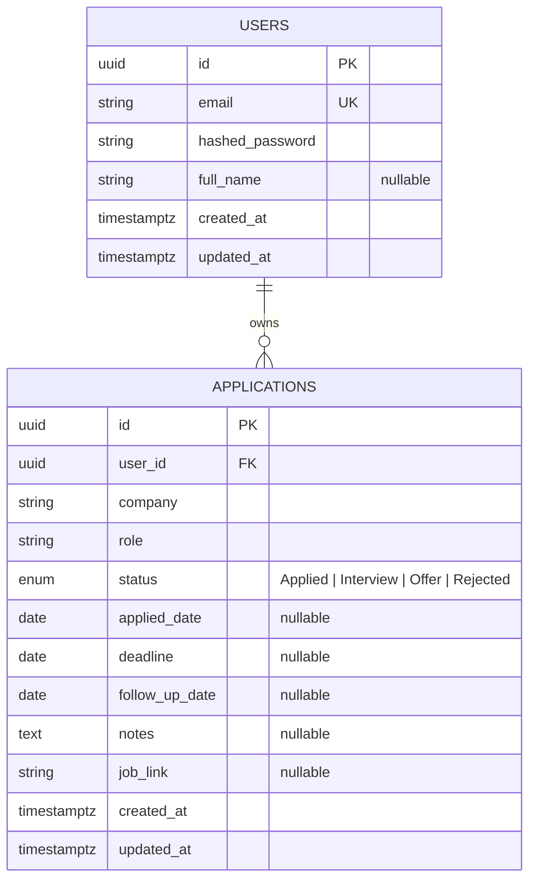

# Database Schema

PostgreSQL, managed via SQLAlchemy models (`backend/app/models/`) + Alembic
migrations (`backend/alembic/versions/`). Source of truth is the models; this
doc is a human-readable mirror — regenerate/update it if the models change.

## ER Diagram

## `users`

| Column            | Type          | Constraints                        |
|-------------------|---------------|-------------------------------------|
| id                | UUID          | PK, default `gen_random_uuid()`-equivalent (generated app-side) |
| email             | VARCHAR(255)  | NOT NULL, UNIQUE, indexed          |
| hashed_password   | VARCHAR(255)  | NOT NULL (bcrypt hash, never plaintext) |
| full_name         | VARCHAR(255)  | nullable                           |
| created_at        | TIMESTAMPTZ   | NOT NULL, default `now()`          |
| updated_at        | TIMESTAMPTZ   | NOT NULL, default `now()`, updated on write |

## `applications`

| Column          | Type          | Constraints                                   |
|-----------------|---------------|------------------------------------------------|
| id              | UUID          | PK                                             |
| user_id         | UUID          | NOT NULL, FK → `users.id` `ON DELETE CASCADE`, indexed |
| company         | VARCHAR(255)  | NOT NULL                                       |
| role            | VARCHAR(255)  | NOT NULL                                       |
| status          | ENUM          | NOT NULL, default `APPLIED`, indexed — one of `Applied`, `Interview`, `Offer`, `Rejected` |
| applied_date    | DATE          | nullable                                       |
| deadline        | DATE          | nullable — e.g. application/offer deadline     |
| follow_up_date  | DATE          | nullable — next follow-up action; drives the reminders feature |
| notes           | TEXT          | nullable                                       |
| job_link        | VARCHAR(2048) | nullable                                       |
| created_at      | TIMESTAMPTZ   | NOT NULL, default `now()`                      |
| updated_at      | TIMESTAMPTZ   | NOT NULL, default `now()`, updated on write    |

## Design notes

- **UUID primary keys, generated in the app (not `gen_random_uuid()` in
  Postgres).** Avoids leaking sequential row counts, and IDs are available
  before insert (useful for the API layer). Requires no Postgres extension.
- **`ON DELETE CASCADE` on `applications.user_id`.** Deleting a user cleans up
  their applications automatically at the DB level — there's no legitimate
  case where an orphaned application should survive its owner's deletion.
- **Native Postgres ENUM for `status`**, not a free-text column or a separate
  lookup table. The status set is small, fixed, and part of the product spec
  (Kanban columns map 1:1 to it) — a lookup table would be overkill, and a
  native enum gets DB-level validation for free. Trade-off: adding a status
  later requires a migration (`ALTER TYPE ... ADD VALUE`), which is
  acceptable given how rarely this changes.
- **Enum stores member *names* (`APPLIED`, `INTERVIEW`, …) in Postgres, while
  the API surfaces the *values* (`"Applied"`, `"Interview"`, …).** This is
  SQLAlchemy's default `Enum` behavior. It means the DB identifier is stable
  even if we ever want to change the display label, while the JSON contract
  stays human-readable. Documented here since it's not obvious from a schema
  dump alone.
- **`deadline` vs `follow_up_date`.** Kept separate because they mean
  different things: `deadline` is an external date set by the employer
  (e.g. "apply by", "respond to offer by"); `follow_up_date` is a
  self-scheduled reminder ("check in a week after interview"). Both feed the
  reminders feature but are edited independently.
- **No separate `companies` table.** `company` is a plain string on
  `applications` rather than a normalized FK. Users apply to the same company
  under different names/spellings often enough that forcing normalization
  would add friction for no real query benefit at this scale; search/filter
  by company works fine with an ILIKE query.
- **Indexes**: `users.email` (unique, used on every login), `applications.user_id`
  (every list/filter query scopes by owner), `applications.status` (Kanban
  board queries and stats group by status).
- **Timestamps are `TIMESTAMPTZ`**, not naive `TIMESTAMP`, so values are
  unambiguous regardless of DB/server timezone.

Once you're happy with this, I'll proceed to Phase 3 (backend API).
